# Selfhosting Guide – GUI Version

## 1 - Introduction <a href="#introduction" id="introduction"></a>

First of all, good job on taking your first step to self-hosting. I know this can be extremely overwhelming for beginners, but I want you to know that it is okay and we have all been there. I have made sure to make this guide as easy to follow as possible and used software and services that would eliminate the most annoying and difficult challenges that first time selfhosters face. While I am aware the title of this guide says GUI version guide, unfortunately, some initial steps still need to be done via terminal. It is only an one-time step and I have made sure it is as short as possible.

***

## 2 - Prerequisites <a href="#prerequisites" id="prerequisites"></a>

### **2.1 A VPS with terminal access.**

Please use [this guide](https://guides.viren070.me/selfhosting/oracle) to get a free VPS and complete all steps 1–12 . Only use my guide after reaching step 12. In most regions, you need to upgrade to PAYG tier to get a free VPS, If you still can’t get a free oracle VPS, you can purchase any other VPS and the steps would be similar (in fact the setup would be way easier than oracle). If your free oracle VPS doesn’t have a public IP, follow [this video](https://www.youtube.com/watch?v=ISEP6SIrEVE\&t=279s) and follow the instructions in the chapter **"VCN and Subnet setup"**.

If you are purchasing a VPS from elsewhere, I recommend a minimum of **4 GB RAM and 2 core vCPU**.

***

### **2.2 A paid domain.**

You can easily get a domain for less than 1$ a year by signing up for a 6-9 digit .xyz domain. For instance, you can try to get a domain for your birthday so it’s easy to remember, so if you were born on 12<sup>th</sup> September 1995, you can look for `120995.xyz` or `12091995.xyz`. It won’t be fancy, but it’s cheap and memorable to you.&#x20;

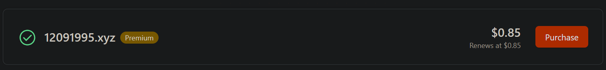

> ⚠️ **MAKE SURE TO CHECK THE RENEWAL PRICE.** Ensure you are locked in at the same price for renewal.

> ❌ Free domains **cannot** be used for the purpose of this guide&#x20;

Some popular domain registrars:

* [https://domains.cloudflare.com/](https://domains.cloudflare.com/)
* [https://www.spaceship.com](https://www.spaceship.com/)
* [https://porkbun.com/](https://porkbun.com/)

***

### **2.3 Connect your domain to your VPS.**

Once you have both a VPS and domain, you need to connect it to each other. This is done in the website you bought your domain from.



Go to `Launchpad → Advanced DNS → click your domain → Add Record → Type: A → Host: * → Value: your VPS public IP → TTL: 1 min → Add`



Go to `Dashboard → Domains → click your domain → DNS → Records → Create A record → Name: * → IPv4: your VPS public IP → Proxy: OFF → Save`



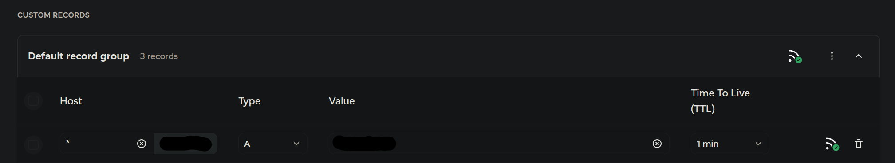 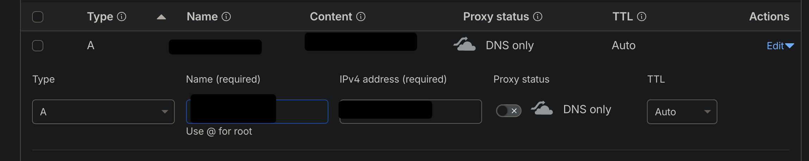

***

## 3 - Let's Get Started <a href="#lets-get-started" id="lets-get-started"></a>

If you followed Viren's oracle VPS setup guide through step 12, you should see something like the following when you SSH into your VPS for the first time.

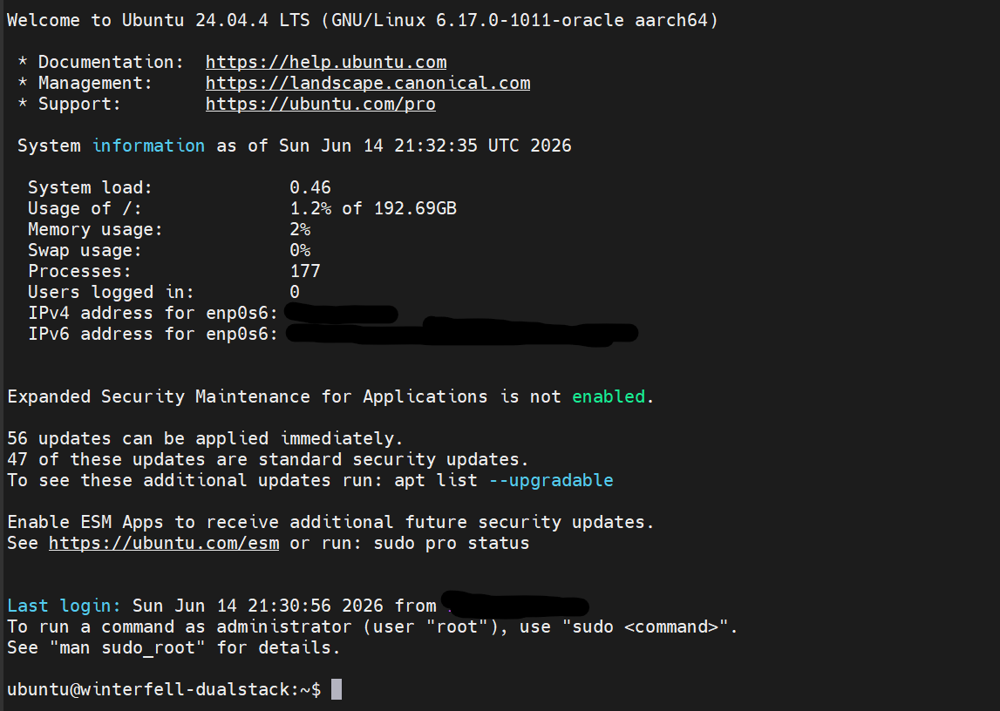

***

### 3.1 Updating the System <a href="#updating-the-system" id="updating-the-system"></a>

Lets first take care of some housekeeping stuff and update the system. Run the following command in the terminal:

```bash
sudo apt update && sudo apt upgrade
```

Wait for it to download the updates and you will see something like this:

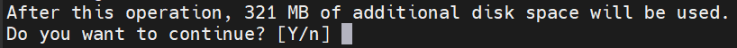

Enter `Y` on your keyboard and wait for the installation to finish. Once it finishes, the progress bar disappears and you can type new commands again.

***

### 3.2 Opening Ports in Oracle Web Console <a href="#opening-ports-in-oracle-web-console" id="opening-ports-in-oracle-web-console"></a>

Now before we proceed, we need to open some necessary ports to be able to access services hosted on your vps.&#x20;

Go to your Oracle console:

`Top left menu → Networking → Virtual Cloud Networks → click your VCN → Subnets → click the default subnet → Security tab → default security list → Security Rules`

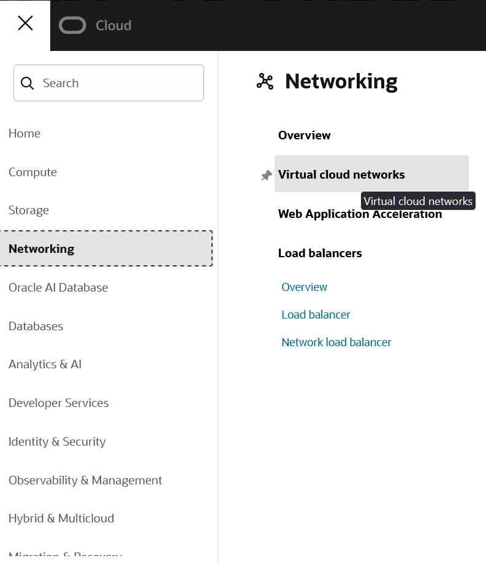 VCN" width="375">

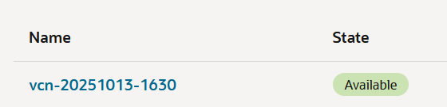

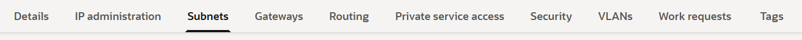

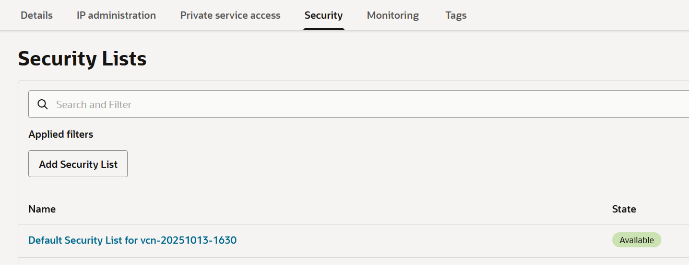

Here, we are going to add **ports 443 (HTTPS)** and **port 80 (HTTP)** for proper functioning of our reverse proxy. Click add Ingress rule and add the following

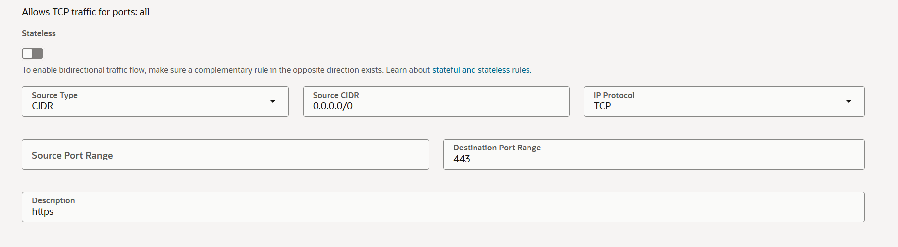 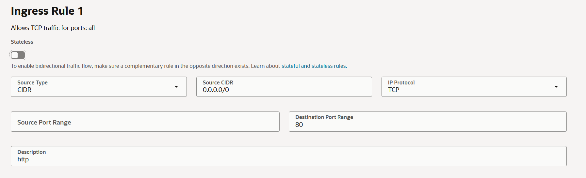

Click **Add Ingress Rules** at the bottom right. If done correctly, the ingress rules will appear as below:

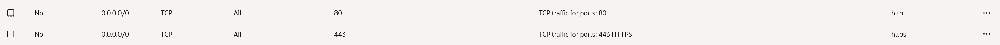

> 💡 **Optional:** You can also add port `51820` now if you plan to host a WireGuard VPN. It is not necessary, you can always come back and add it later.

***

## 4 - Reverse Proxy - Pangolin

### 4.1 Installing Pangolin <a href="#installing-pangolin-reverse-proxy" id="installing-pangolin-reverse-proxy"></a>

Back in your terminal, run the following script:

```bash
curl -fsSL https://static.pangolin.net/get-installer.sh | bash
```

Once it says `ready to use`, run the installer:

```bash
sudo ./installer
```

When it asks for a directory, enter `./pangolin`, when it asks for confirmation, submit yes by pressing `Y` button on your keyboard. For you, it would say `/home/ubuntu/pangolin`. Which is fine. I just changed the username, so don’t mind that.

<div>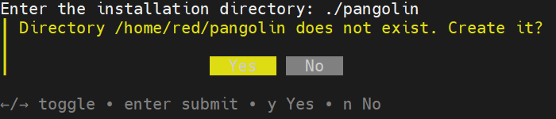 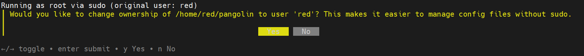</div>

When asked to Install Enterprise version, Say yes. It is free and will come handy in the future.&#x20;

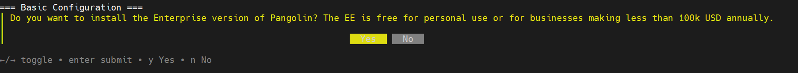

For Postgress, We are going to say No. We don't need it for our use case. Click `N`

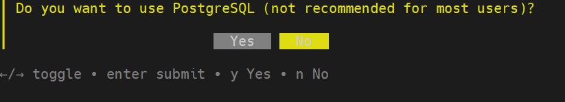

Enter the domain when asked for it.&#x20;

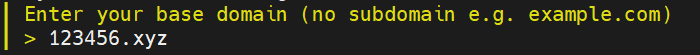

⚠️ **PLEASE ENTER YOUR CORRECT DOMAIN.** The `123456.xyz` shown in screenshots is only an example.

For Pangolin Domain, just click `enter` button on your keyboard. The default `pangolin.domain.xyz` is fine.

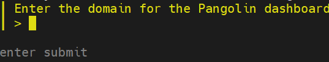

For email, enter your personal/spare **VALID** email address here.

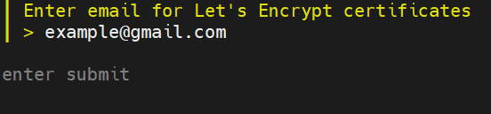

Enter `Y` for Gerbil. Enter `N` for SMTP.

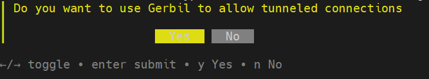 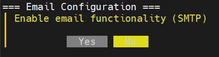

For IPV6 prompt, enter `Y` if you have one, if you are unsure what that means, just enter `N`.

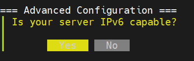

Enter `Y` for geoblock functionality.

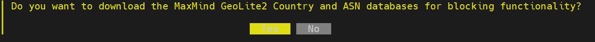

For the choice of docker vs podman, We are going to use docker, by default It is docker, so just press `Enter` . It will ask confirmation to start the containers, and then to install Docker, click `Y`  for both.

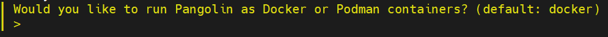 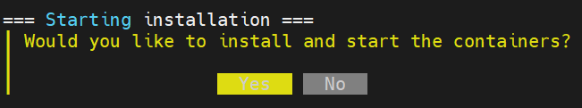 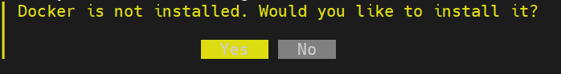

Once the installation is done, it should now give you a setup token, look for it!

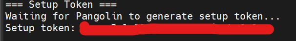

***

### 4.2 Setting Up Pangolin via GUI <a href="#setting-up-pangolin-via-gui" id="setting-up-pangolin-via-gui"></a>

Open your browser and go to `pangolin.yourdomain.xyz`. You should see the following

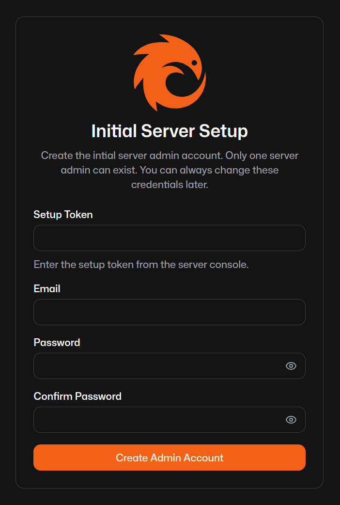

<details>

<summary>Can't access the website?</summary>

1. Ensure the prerequisite steps were done properly by pointing your domain to the VPS IP.
2. Make sure your ports 443 and 80 are open.
3. Check that you entered your correct domain during installation (re-run the install script if needed).

</details>

Copy and paste the setup token here and create an admin account. Once done, login using the details. Proceed to create an organization using any name, it doesn’t matter. It would then ask you to create a new site.&#x20;

When asked to create a new site, click **Local**, name it "oracle vps" (or anything you like), and click **Create Site**.

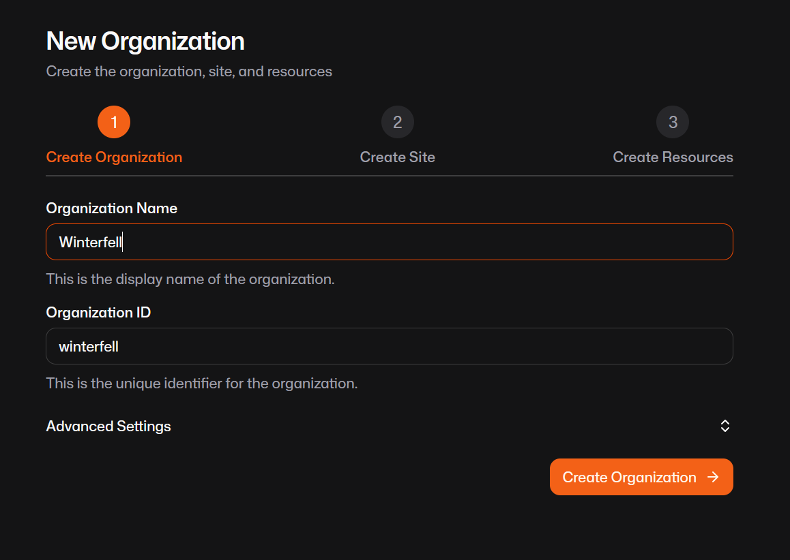 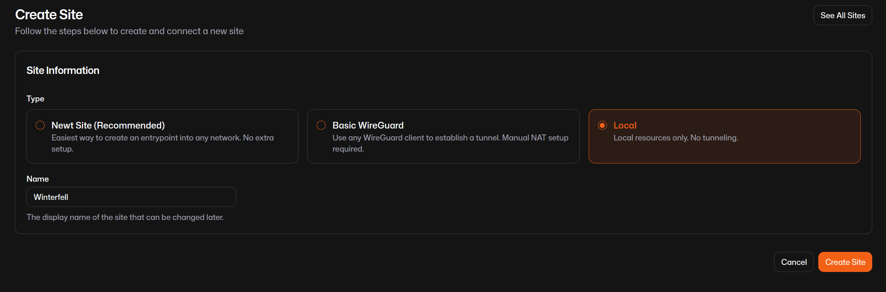

You have now finished setting up your GUI-based reverse proxy. On the left sidebar, click **Sites** to confirm it was created.

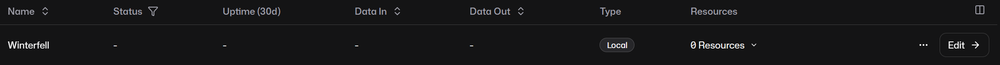

***

## 5 - Docker Manager - Dockhand

### 5.1 Deploying Dockhand <a href="#deploying-dockhand" id="deploying-dockhand"></a>

Run the following script in your terminal:

```bash
curl -fsSL https://raw.githubusercontent.com/Redhair777/dockhand-install-script/main/install.sh | sudo bash
```

All containers should be created smoothly.

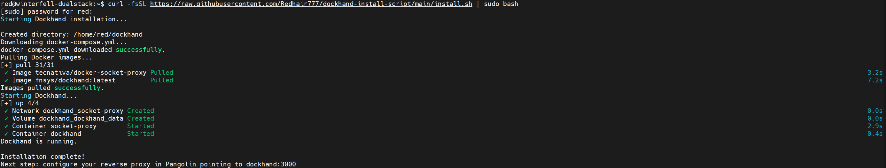

Now go back to `pangolin.yourdomain.xyz`. Click on the ‘Public’ under ‘ Resources’.

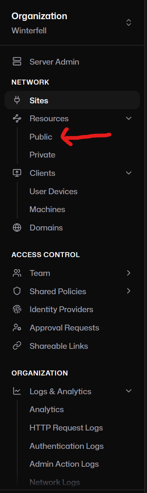 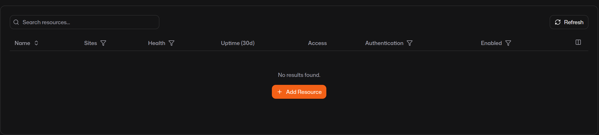

Click _**Add Resource**_, Enter **dockhand** as both the name and subdomain. Scroll down and click **Add Target**, then enter:

* **Host:** `dockhand`
* **Port:** `3000`

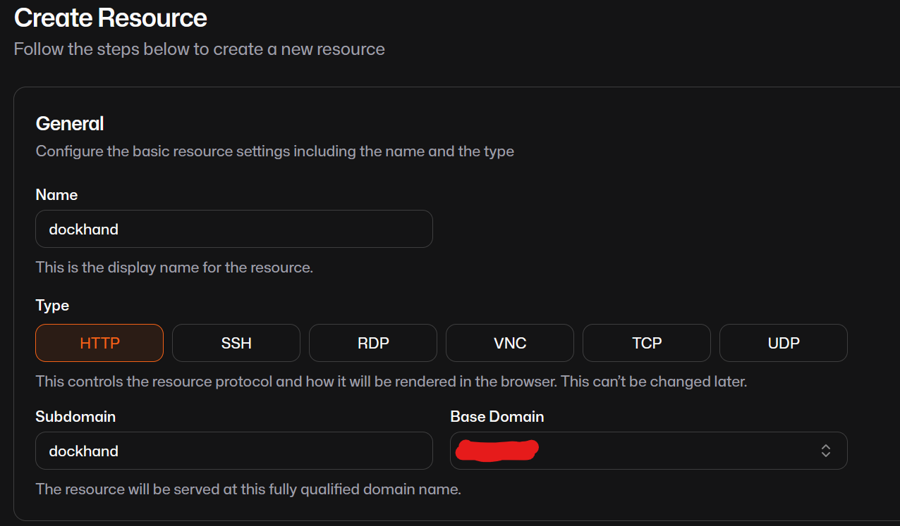


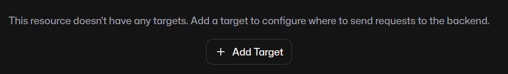 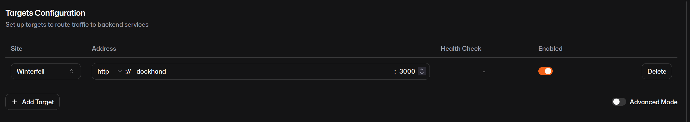

***

### 5.2 Setting Up Dockhand in GUI <a href="#setting-up-dockhand-in-gui" id="setting-up-dockhand-in-gui"></a>

Now go to `dockhand.yourdomain.xyz`. You should be welcomed with the following page.&#x20;

Click **Got it** and then **Go to Settings**.

<div>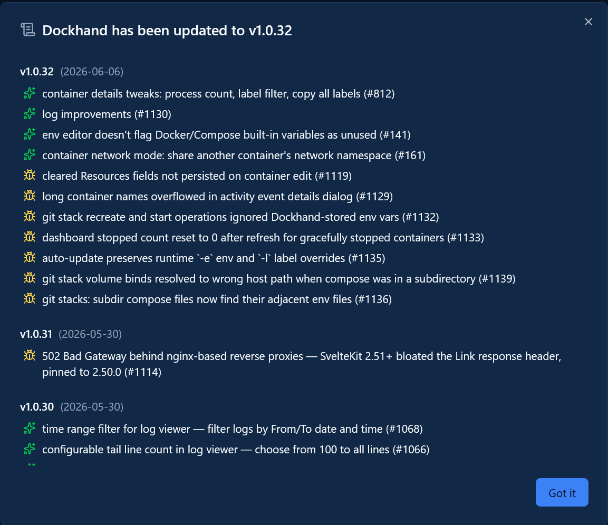 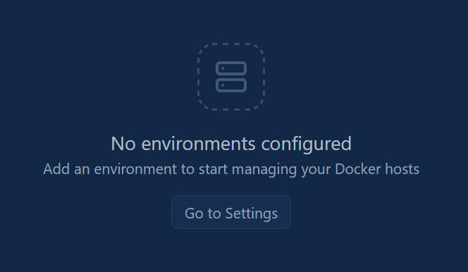</div>

Click **Add Environment**.

Configure the environment as follows:

* **Name:** `Oracle VPS` (or anything you like)
* **Connection Type:** `Direct Connection`
* **Host:** `socket-proxy`
* **Port:** `2375`

<div>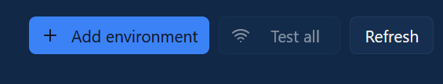 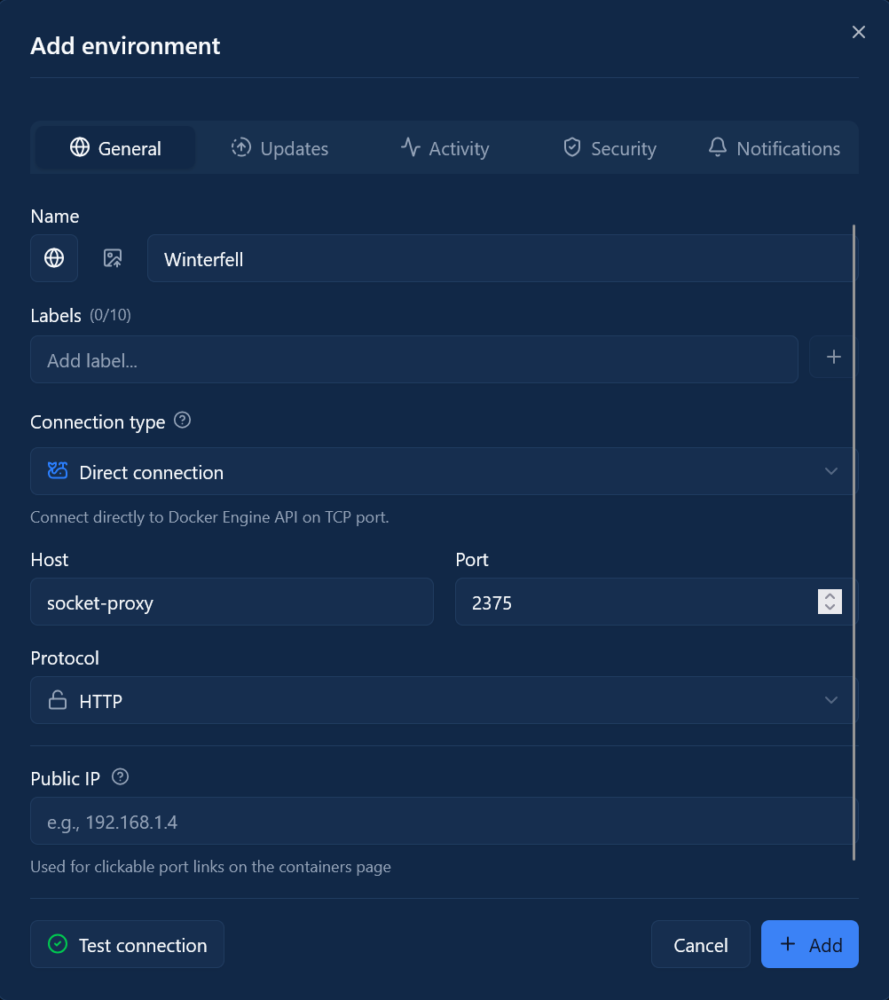</div>

Click **Test Connection,** you should see "Connected" appear in the bottom right.

Under the **Update** section, enable:

* `Scheduled update check`
* `Automatic image pruning`

Set your time zone, then click **Add**.

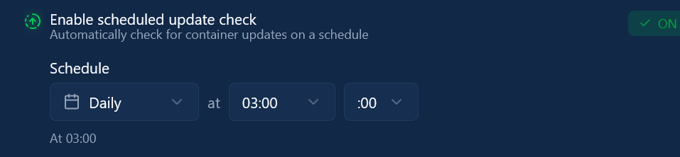 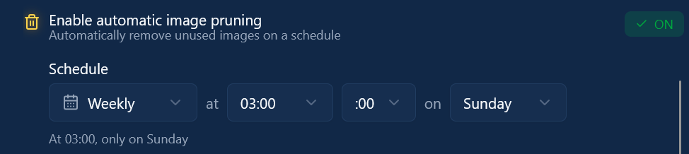

Click the WiFi button to check the connection, The status should show as **Connected**.

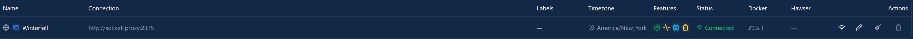

Click **Containers** on the left and you can now see all the services you are running.

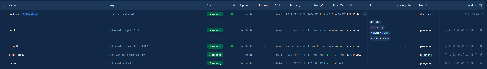

> If you have reached this point. Congratulations! Pat yourself on the back, you have now finished setting up the hardest parts of selfhosting and everything from now on is only easier and can be done fully via GUI in a web browser, feel free to close all your terminal.

***

## 6 - AIOstreams

### 6.1 Deploying AIOstreams <a href="#deploying-aiostreams" id="deploying-aiostreams"></a>

First, Let's create a dedicated network for all AIOstreams-related services.&#x20;

`Dockhand GUI → Networks → +Create → Name: aiostreams → Create Network`

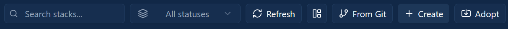 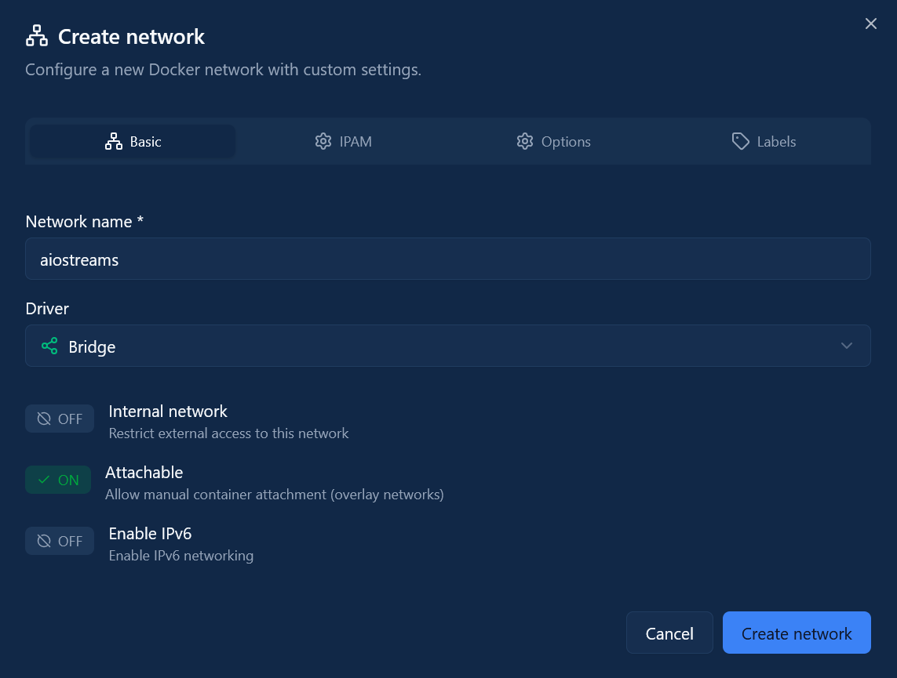

Now Let's create the stack:

`Dockhand → Stacks → +Create`

Give the stack the name **aiostreams**. In the left compose file section, paste the following:

```yaml
services:
  aiostreams:
    image: ghcr.io/viren070/aiostreams:latest
    container_name: aiostreams
    restart: unless-stopped
    expose:
      - 3000
    env_file:
      - .env
    volumes:
      - ./data:/app/data
    networks:
      - pangolin_frontend
      - aiostreams

networks:
  pangolin_frontend:
    external: true
  aiostreams:
    external: true
```

In the **right side (environment variables)**, add the following env values:

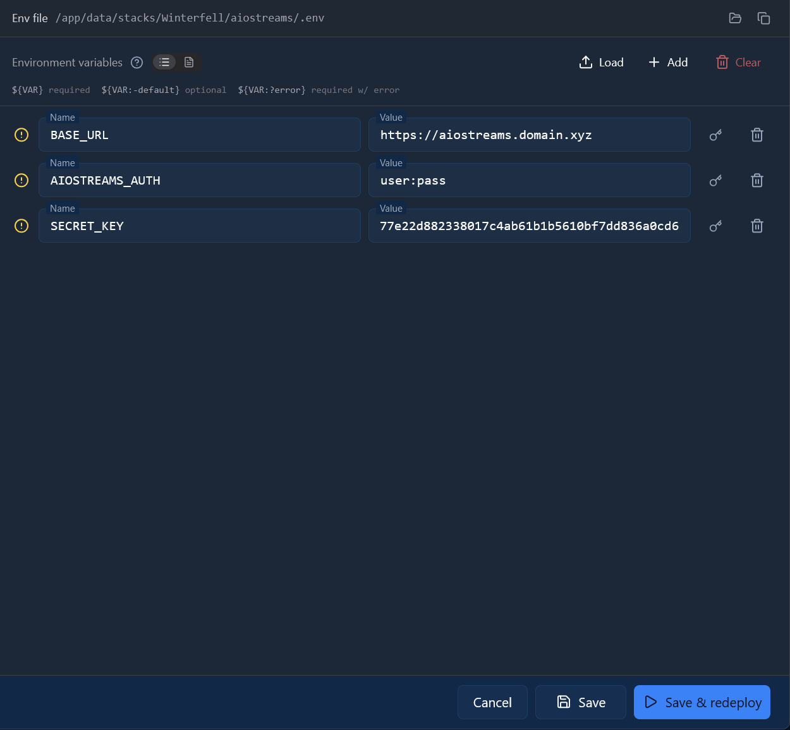

Replace the `https.//aiostreams.domain.xyz` value with your actual domain. Change `user:pass` to your a username and password of your choice.

For **secret key** you need to generate one. Here are two ways to do it, choose whichever is simple for you:



Click **Shell** in the Dockhand sidebar, choose the `pangolin` container from the dropdown, and run:

```bash
openssl rand -hex 32
```



Use [https://codebeautify.org/generate-random-hexadecimal-numbers](https://codebeautify.org/generate-random-hexadecimal-numbers) with the Length set to **64**.



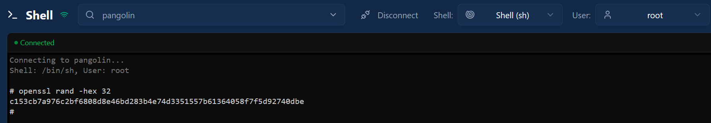 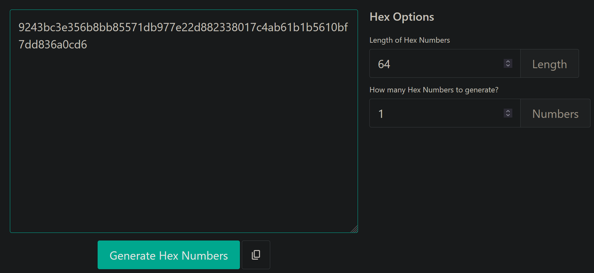

Regardless of what method you choose, just copy the hex string and paste it into the `SECRET_KEY` env variable.

Click **Save and Deploy**.

***

### 6.2 Setting Up Auth and Reverse Proxy for AIOstreams <a href="#setting-up-auth-and-reverse-proxy-for-aiostreams" id="setting-up-auth-and-reverse-proxy-for-aiostreams"></a>

Now time to go to pangolin and tell it to put aiostreams behind this domain `aiostreams.domain.xyz`. See how in the compose file on the left we have `container_name: aiostreams` and `expose: 3000` , this means that the app is available at `aiostreams:3000` to pangolin.

`Pangolin Dashbaord → Resources → Public (in the left sidebar) → Add Resource`

Add `aiostreams` resource as shown below and click **Create Resource**.

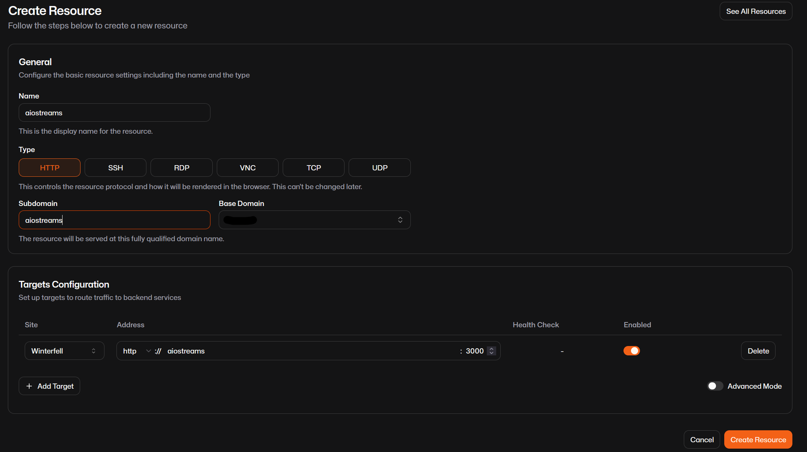

AIOstreams should now be accessible at `aiostreams.yourdomain.xyz`.

Let's test it, go add **Comet** from the marketplace, save the config, and click **Install to Stremio**.

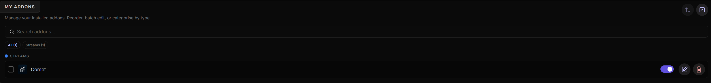

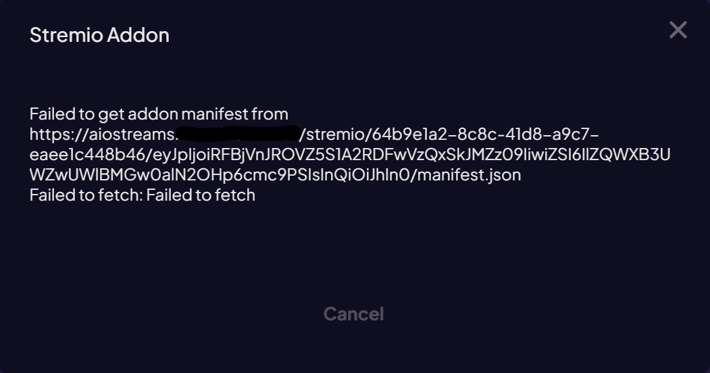

If you get the failed to get manifest, **DO NOT PANIC**. This is expected and intentional. I purposefully made this error because I want **YOU TO LEARN** why this is happening. To understand why this is happening, copy the manifest URL in the save section of aiostreams instead of clicking install to stremio and paste it in a browser in **INCOGNITO** mode. You should get pangolin’s auth screen.

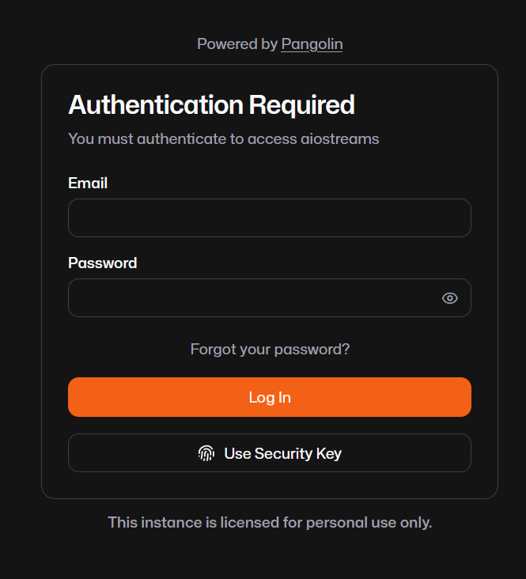

This is why Stremio can’t install it. It is because Pangolin is blocking the installation. You can also confirm this by going to pangolin dashboard.

`Pangolin → Organisation → HTTP Requests`

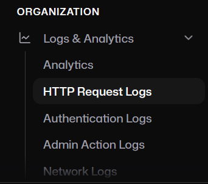

> 💡 If you don't see the HTTP Requests section, you need to upgrade to Pangolin Enterprise Edition, which is **free for personal use.** Please check FAQ section on how to activate it.

Filter requests by resource and choose **aiostreams**:

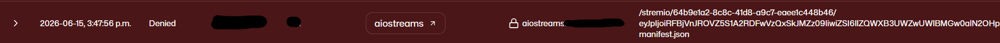

You'll see that Stremio tried to access `aiostreams.yourdomain.xyz/stremio/…` and was denied. Let's fix that.

Go to `Pangolin → Public → Resources → Edit aiostreams → Access Rules`

Add a rule to bypass auth for the path `stremio/*` like shown below.

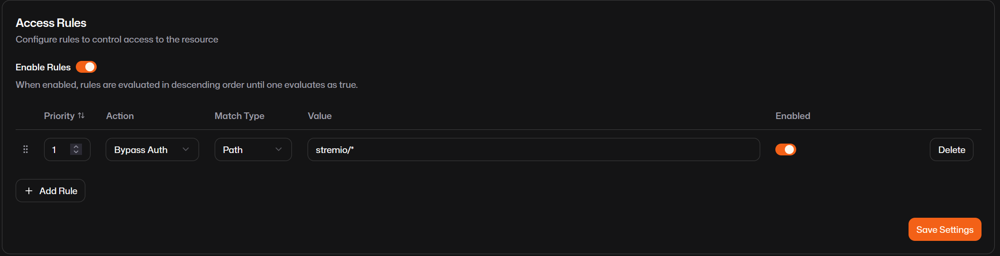

Click **Save Settings**. This setting means that anyone trying to access a URL that starts with `aiostreams.domain.xyz/stremio/…` will no longer be blocked by pangolin. To confirm it, try pasting your manifest URL in incognito again and it should work. Now try installing it to stremio and it should successfully install. However, this alone is not enough for proper functioning of aiostreams.  Since you may use proxy features. For proxy streams to work properly you need to also add rule to bypass `api/v1/proxy/*` . I also blocked all config pages by blocking `*/configure/*` and by setting it at the highest priority. This will ensure anyone trying to create a config needs to login to pangolin ( for friends and family you can create a temporary password for pangolin).


### 6.3 Understanding Pangolin's Security

You may need to add more rules depending on your use case. The way to find what's being blocked is, go to `Pangolin → Organisation → HTTP Request Logs`. Identify your own requests by IP and country, then add bypass rules for any paths being blocked for your IP.

However, Do not allow random requests! For example, A bot from the Netherlands is probing my AIOstreams and is being denied, I do NOT want to accidentally allow it. Ensure whatever path or IP you allow is relevant to you. Do not let any malicious requests through.


Here is an example of how I am adding a **country-based rule** to restrict access to only my country and stop the activity of foreign bots.&#x20;


> ⚠️ **Do not rely solely on geo-blocks.** There can be bots or bad actors from your own country. For safe usage, **block all access by default**, then **only allow specific paths** (like `stremio/*`) on top of geo-blocks.

I have purposefully only gone through only the basic configuration of aiostreams since it’s a highly customizable and configurable tool and there already exists documentation for it. If you are looking for specific options, you can check out the  [official documentation](https://docs.aiostreams.viren070.me/). The AIOstreams Discord is also a great place to ask for help.

> If someone tells you to "add something to your env", go to `Dockhand → Stacks → aiostreams` and add/change what you need on the right side. On the latest versions, you can do most things directly via the AIOstreams admin panel.

***

## 7 - AIOmetadata <a href="#deploying-aiometadata" id="deploying-aiometadata"></a>

### 7.1 Deploying AIOmetadata

Once again, Let's create a dedicated network for AIOmetadata:

`Dockhand → Networks → Create New → Name: aiometadata`

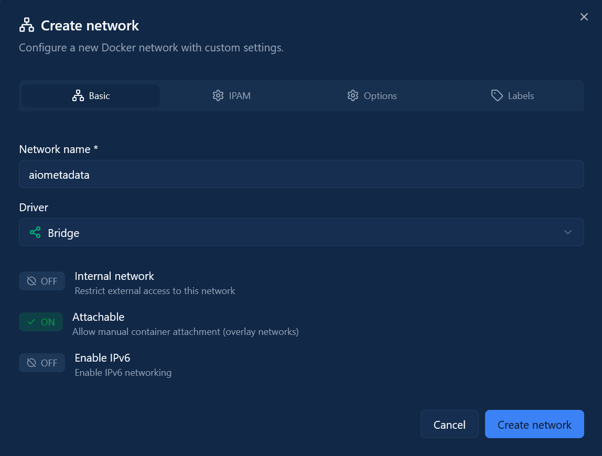

This allows Redis and other future containers to communicate with AIOmetadata.

Now create the stack:

`Dockhand → Stacks → Create`

Paste the following compose on the left:

```yaml
services:
  aiometadata:
    image: ghcr.io/cedya77/aiometadata:latest
    container_name: aiometadata
    restart: unless-stopped
    expose:
      - 3232
    env_file:
      - .env
    volumes:
      - ./aiometadata/data:/app/addon/data
    networks:
      - pangolin_frontend
      - aiometadata
    depends_on:
      aiometadata_redis:
        condition: service_healthy
    tty: true
    healthcheck:
      test: ["CMD", "wget", "--no-verbose", "--tries=1", "--spider", "http://localhost:3232/health"]
      interval: 30s
      timeout: 10s
      retries: 3
      start_period: 40s

  aiometadata_redis:
    image: redis:latest
    container_name: aiometadata_redis
    restart: unless-stopped
    networks:
      - aiometadata
    expose:
      - 6379
    volumes:
      - ./aiometadata/cache:/data
    command: redis-server --appendonly yes --save 3600 1
    healthcheck:
      test: ["CMD", "redis-cli", "ping"]
      interval: 10s
      timeout: 5s
      retries: 5

networks:
  pangolin_frontend:
    external: true
  aiometadata:
    external: true
```

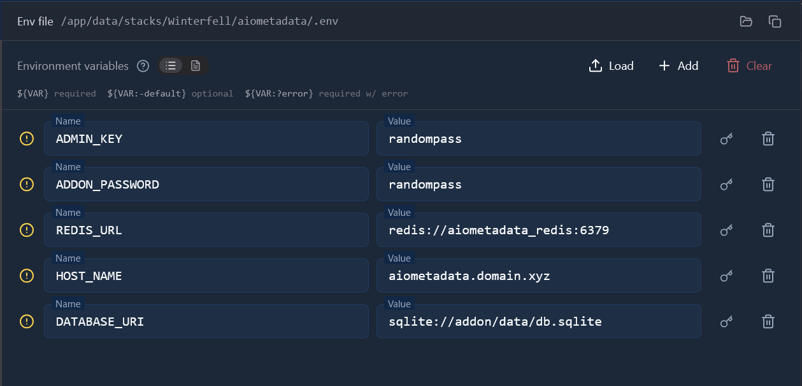

Click **Deploy** and AIOmetadata should be ready to use.

And as always, go to Pangolin:

`Pangolin → Public → Resources → Add Resource → aiometadata → Create Resource`

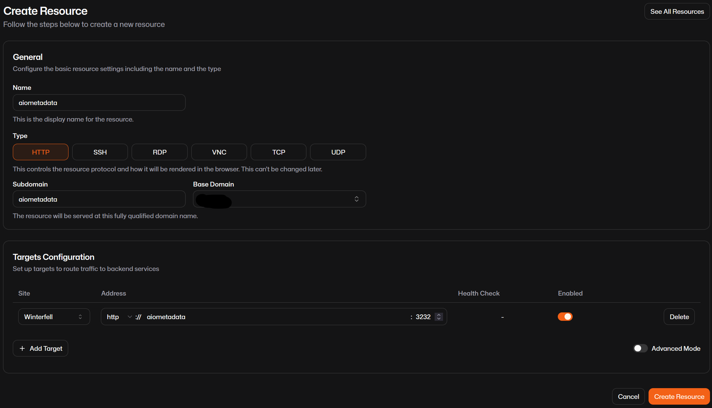

AIOmetadata should now be accessible at `aiometadata.yourdomain.xyz`. Add the following Access Rules to prevent Pangolin from Interfering with any functionality.


You may need to add more rules, If you plan on adding Trakt, Simkl and other integrations integration. Loop back to this section later when you are setting them.

### 7.2 Setting up AIOmetadata

Comprehensive warming is one of the main reasons to selfhost Aiometadata. It ensures that all your catalogues and lists are warmed/prepped so that all the titles load instantly on your client. It makes the performance of your stremio client so much faster. Note that posters would still not load as fast without poster cache. In order to do this, first create a config in aiometadata with whatever lists you desire. If you have no idea where to start, the default presents are a great place to start. Choose any present you want

<figure><figcaption></figcaption></figure>

For this example I have chosen the Movies & Shows + Anime (TVDB). Click continue after making your choice.  Choose if you want to enable Adult content, I would leave the bottom label as default, and click continue.

<figure><figcaption></figcaption></figure>

The next step is to enter TMDB and TVDB keys. You **NEED** both of them for this preset. If you don't have one, simply click 'get key' and it should take you to appropriate website to get them. Both keys are completely free. Once you got the keys, enter them and click **Test key.**  It should say key valid. You can then click continue.&#x20;

<figure><figcaption></figcaption></figure>

If you want any of these streaming catalogues, enable them and then click continue. I am going to leave them disabled for my example

<figure><figcaption></figcaption></figure>

You can skip the MDBlist collections for now. You can come back later and add any specific lists you want after integrating MDBlist. Click **Continue.** I am also skipping AI catalogues for this guide. You can do it later once you get your Gemini API key.

<div><figure><figcaption></figcaption></figure> <figure><figcaption></figcaption></figure></div>

Once done, Click **Apply Preset** and click **Go to Configuration,** Then Click **Save Configuration.**

<div><figure><figcaption></figcaption></figure> <figure><figcaption></figcaption></figure></div>

You will now be able to install the addon, as well view your UUID. Feel free to install the addon. But also copy your UUID. We will need it to setup comprehensive warming.

### 7.3 Setting up Comprehensive Warming

Visit `aiometadata.yourdomain.xyz/dashboard` . As always, replace `yourdomain` with your actual domain. You will be welcomed with a login screen. Choose **Admin Login**, and enter your Admin key. If you forgot what that is, go to dockhand->stacks->aiometadata->see admin key in the env on the right side.

<div><figure><figcaption></figcaption></figure> <figure><figcaption></figcaption></figure></div>

In the dashboard, Go to **`Settings`**` ``->`` `**`Comprehensive Warming`**. Switch **Warmup Mode** from Essential to comprehensive. Enter your UUID you got from earlier and click the save button. And you should be done with enabling comprehensive warming. One of the best features of AIOMetadata!

<figure><figcaption></figcaption></figure>

### 7.4 Disabling Cinemeta

In order to make sure your client is actually AIOMetadata and not just Cinemeta that comes bundled with Stremio and some other clients, we need to disable cinemeta. If you are not using Stremio client, just delete Cinemeta if you see it in your addon list. If you are using stremio, go to [`https://cinebye.elfhosted.com/`](https://cinebye.elfhosted.com/)`.` Login using your stremio credentials.

<figure><figcaption></figcaption></figure>

Scroll down to **Options**, and enable all the options (download a backup if you are afraid). Then scroll down to **Manage Addons** and drag AIOMetadata all the way to the top, but right below Cinemeta. Then scroll back up one section and click **Sync to Stremio**. Then force restart your clients and all your clients should now be using AIOMetadata.

<div><figure><figcaption></figcaption></figure> <figure><figcaption></figcaption></figure></div>

<figure><figcaption></figcaption></figure>

You can now play around your configuration (where you got your UUID) and add custom posters, custom catalogues, edit catalogue names and so much more, all for **FREE**. Feel free to join the AIOMetadata channel inside the AIOstreams discord server for help on how to make your setup better.

<figure><figcaption><p>Fully customised stremio with custom posters and edited catalog names</p></figcaption></figure>

For more features like anilist/mdblist/trakt integration, Poster cache and how to set them up, please look at the [official documentation](https://github.com/cedya77/aiometadata). find the sample env, look for features you want and add them to env section (the right side of compose in dockhand UI).

> 📝 I am not going to go over PosterCache in this guide because it requires terminal access for some steps and this guide is focused on GUI

***

## 8 - Usenet Streaming setup

### 8.1 Deploying NZBDavex <a href="#deploying-nzbdavex-usenet-streaming" id="deploying-nzbdavex-usenet-streaming"></a>

`Dockhand → Stacks → Create New`

Paste the following compose on the left:

```yaml
services:
  nzbdavex:
    image: ghcr.io/qooode/nzbdavex:edge
    container_name: nzbdavex
    restart: unless-stopped
    expose:
      - 3000
    volumes:
      - ./nzbdavex_config:/config
    environment:
      - DISABLE_FRONTEND_AUTH=true
    networks:
      - pangolin_frontend
      - aiostreams

networks:
  pangolin_frontend:
    external: true
  aiostreams:
    external: true
```

Click **Save and Deploy**. We are adding NZBdavex to AIOstreams network as well so we can connect them later. Once deployed, To confirm they are connected to each other, click on the **Networks** on the left side. And click **View graph**

We can see two lines from  `aiostreams` network, one to the `aiostreams` container and one to `nzbdavex` container. This means that both AIOstreams and NZBdavex can talk to each other via the `aiostreams` network.

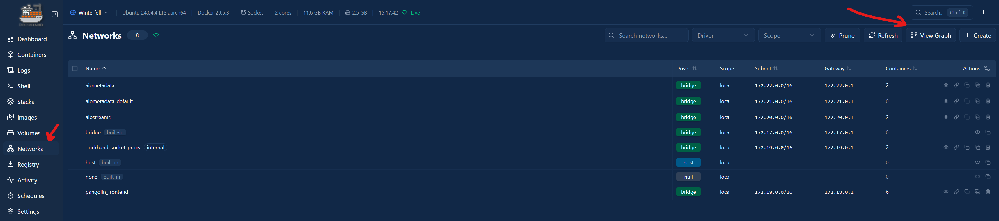 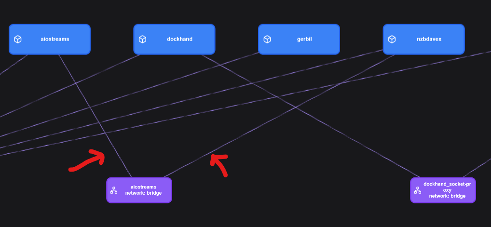

By this time, you should know the usual drill. Go to Pangolin dashboard and add nzbdavex as a resource. You can look up the container name and the exposed port in the compose file. I am purposefully not putting a screenshot here, so that **YOU CAN LEARN TO DO IT ON YOUR OWN**.

***

### 8.2 Setting Up NZBDavex <a href="#setting-up-nzbdavex" id="setting-up-nzbdavex"></a>

You will see this on your first visit.

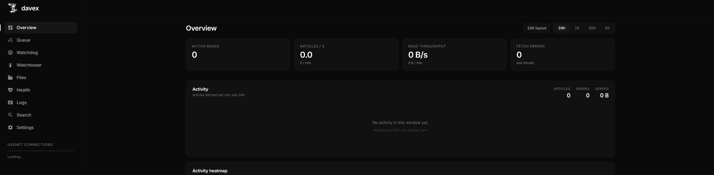

#### 8.2.1 Usenet Providers

If you don’t have any providers or indexers, you need to purchase them. The usenet providers and indexers are a whole separate rabbit hole on its own. The general recommendation is to get one with **Omicron** backbone - [https://usenet.rexum.space/deals?backbones=Omicron](https://usenet.rexum.space/deals?backbones=Omicron). Find the cheapest deal you find and purchase it.&#x20;

> **Black Friday** is usually the best time to purchase providers and indexers, prices are typically at all-time lows. If you have **Torbox Pro,** starting July 1st 2026, it offers NNTP provider details which you can use for instant Usenet streaming without needing to purchase a provider (you still need indexers).

In my humble opinion, it is not worth spending over 30$ a year on a provider, considering there are great deals out there (When purchasing outside of BF deals, there may be no other choice to purchase at a higher rate).

#### 8.2.2 Usenet Indexers

You can get away with free ones like for very light usage:

* **Althub** — [https://althub.co.za/](https://althub.co.za/) — 100 API hits and 25 grabs per day
* **Usenet Crawler** — [https://www.usenet-crawler.com](https://www.usenet-crawler.com/) — 100 API hits and 10 grabs per day

But it is highly recommended to purchase at least one paid tier even if you are using it as a backup to Debrid. Common indexer suggestions are **Althub**, **NinjaCentral**, **Drunkenslug**, **NZBgeek**, **Usenet Crawler** etc. A lot of these indexers offer lifetime options, which are heavily discounted during BF deals (and are considered bad deals when purchased outside of this window).\
If you don’t see any deals, purchase the smallest plan outside of deal window, and wait for Black Friday to purchase for a cheaper price.

⚠️ **Important:** Some Indexers are against using them for direct Usenet streaming like we are doing now and also block oracle VPS entirely. Please do your research and spend money on indexers that are okay with your use case. You can join the AIOstreams discord server to ask others about which indexers are problematic so you can avoid them. IMO you should not be spending your hard earned money on indexers that don't want you.

#### 8.2.3 Adding a Provider

`NZBDavex → Settings → Usenet → Add Provider`

You can find the Host URL, max connections, username/password, port and other information in your provider dashboard after you have purchased a plan. Always choose SSL ports, most providers offer it at port **563** and **443**. For Type use “Pool connections” if you purchased an unlimited plan, Use “backup” if you purchased a block that lasts only for 1 TB (you can also enter this in the data cap below).&#x20;

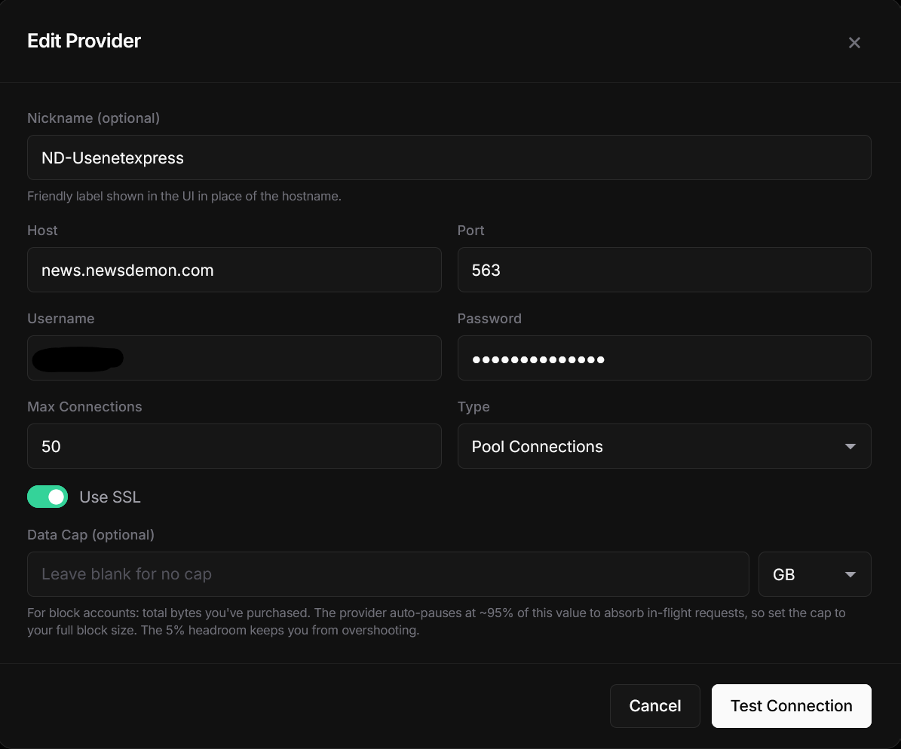

Once all details are entered, click **Test Connection** and it should say connection successful if you entered your credentials properly. Go ahead and click save provider. You may need to click save once again at the bottom. You can continue to add more providers or just stop here.

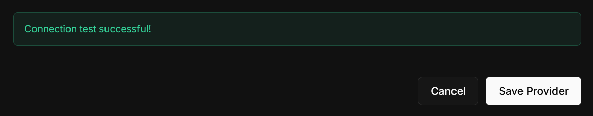

#### 8.2.4 Adding Indexers

For indexers, you have two options:

* Add to **NZBDavex** (enables features like Watchdog, Watchtower)
* Add to **AIOstreams** (easier to switch between services like altmount/nzbdav/stremthru)

For the purpose of this guide, I am going to keep it simple and add the indexer to NZBdavex directly. Go to indexer section under settings and configure indexer. Go to Indexer section (adjacent to providers) and lets start adding our first indexer.&#x20;

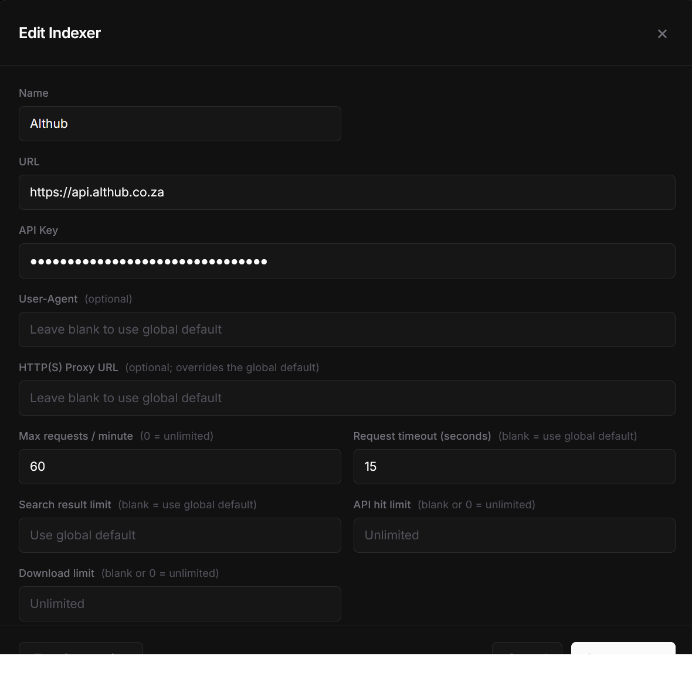

I used max requests limit just to not accidentally ping the indexer too much, but it is entirely optional. I also set a timeout of 15s to stop searching if it exceeds this amount. Once done, click test connection at the bottom left to ensure it works.

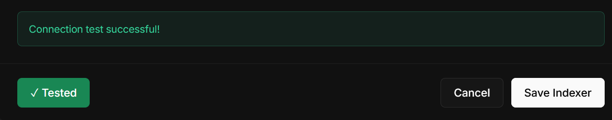

Click **Save Indexer**. You may need to click save once again at the bottom. Next go to search profiles, name the profiles “AIOstreams” . Feel free to experiment with different options, but for now I am going with the following settings:


Remember this profile section, we need to come back here later to get our Addon `manifest.json`. Next, Go to `Advanced section-> webdav` and set a `webdav` password here and click **Save**.

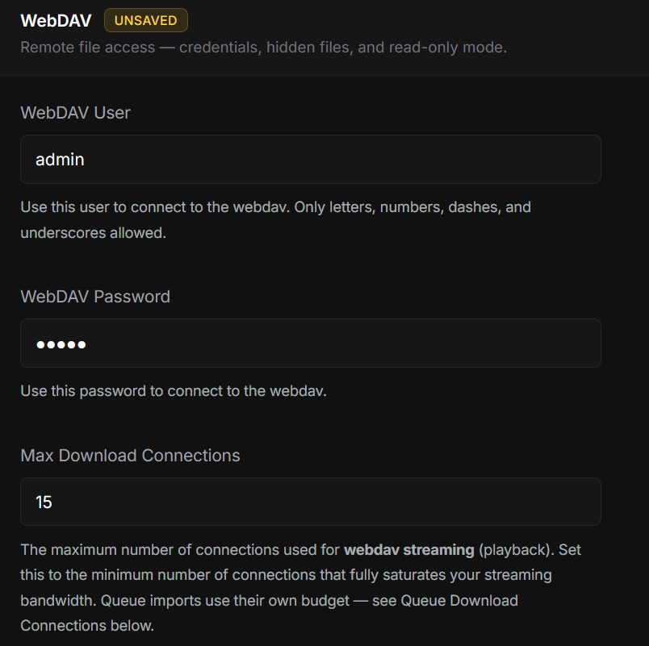

Then go to SABnzbd section and add the URL `http://nzbdavex:3000` to base URL section. Click **Save**.

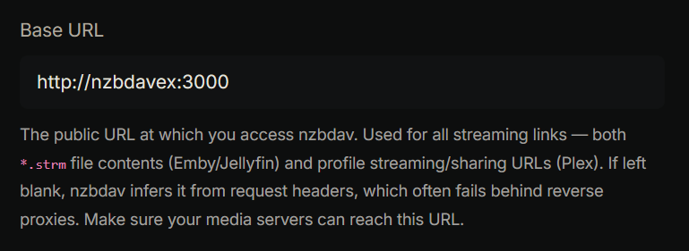

That should be it for the basics. We can now add it to AIOstreams.

***

### 8.3 Connecting NZBDavex to AIOstreams <a href="#connecting-nzbdavex-to-aiostreams" id="connecting-nzbdavex-to-aiostreams"></a>

Currently Nzbdavex is not present in AIOstreams market place, as such, we will add it as `Usenet streamer` addon for the time being.

`AIOstreams → Addons → Marketplace → search "Usenet Streamer" → Configure`

📝 If NZBDavex gets native marketplace support in the future, choose that directly instead.

Rename the addon and paste the **Addon URL** from the Profile section of NZBDavex (Just scroll up and we had a bunch of URLs in the profile section of Nzbdavex settings)

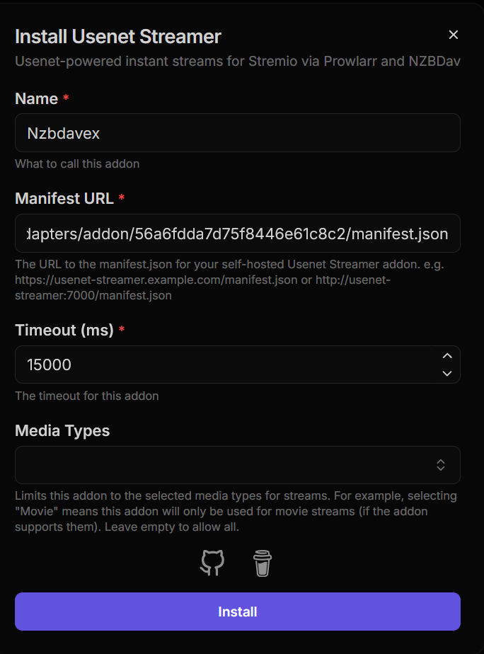

Before clicking install, modify the URL. The default URL will look something like:

```
https://nzbdavex.yourdomain.xyz/adapters/addon/56a6fdda7d75f8446e61c8c2/manifest.json
```

Replace `https://nzbdavex.yourdomain.xyz` with `http://nzbdavex:3000`, so it becomes:

```
http://nzbdavex:3000/adapters/addon/56a6fdda7d75f8446e61c8c2/manifest.json
```

We are doing this so that AIOstreams can bypass Pangolin Auth and if you remember, we connected NZBdavex and AIOstreams with the `aiostreams` docker network (the one we saw in networks diagram).

Once installed. Lets also make sure this is proxied. Go to the proxy section of AIOstreams (you can see it on the left side)

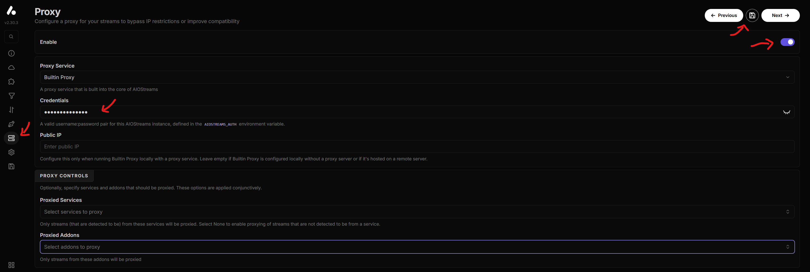

Enable Built in proxy and enter your credentials here. For the auth details, enter the `user:pass` you set in the AIOstreams env. If you forgot, go to:

`Dockhand → Stacks → aiostreams → check AIOSTREAMS_AUTH on the right side`


⚠️ You **must** enable Builtin proxy with correct credentials, otherwise NZBDavex won't work.

Click **Save** and install AIOstreams to Stremio if you haven't already. When you search for a title on Stremio, you should start seeing results for it from NZBdavex.

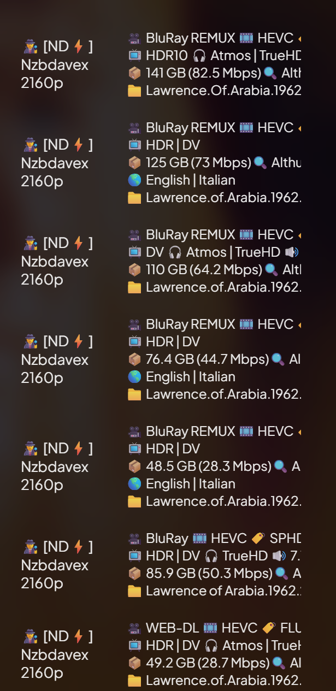

When you click a link, it should also appear in the NZBdavex queue dashboard, and the video will play.

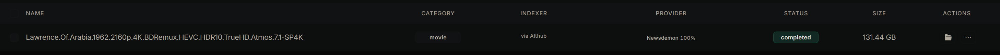

> 🔴 **If it doesn't work.** You have missed a step somewhere, please go back up, go over the steps and ensure you have done all steps correctly. If you still have questions, feel free to pop into the Aiostreams [discord](https://discord.gg/jdJUYnM2) server and ask for help. There is also NZBdavex [discord](https://discord.gg/6UeXw7QN) server if you want help specific to that.&#x20;

***

## 9 - FAQ

#### 1. Why make another guide when Viren's guide exists? What is the difference?

As the mentioned in the title, this guide is specifically focused on a GUI way of deploying and maintaining your stack. While Viren does have services like 'Arcane' in his compose templates, A lot of the guide focuses on working via the terminal. When I first started selfhosting, I found working via the terminal right off the bat, very difficult. I looked up guides and found a more approachable way to selfhosting and I wanted to share this knowledge to others who have put away selfhosting because they found it difficult. If you are in the IT industry or looking to learn more the topic and develop your knowledge in this field, I highly recommend sticking with and using [Viren's guides](https://guides.viren070.me/selfhosting).&#x20;

#### 2. Why isn't your guide starting from setting up Oracle VPS?&#x20;

Primarily because Oracle changes their UI and offerings a lot. I have seen Viren struggle to update them constantly and I have learned my lesson, It is simply too much effort to keep on top of Oracle's changes. Besides there already exists many guides on acquiring a free VPS from Oracle, I don't want to make a guide on things that others have already made.

#### 2. Why NZBdavex and not the original NZBdav or other projects like Altmount?

I chose NZBdavex because it is the service I have been using as my main. There are many more projects that all achieve the same result. I encourage everyone to use the knowledge you have gained from this guide and try out other services and see what works best for you.

#### 3. Torrentio is not working? Why?

If you are hosting in oracle VPS, there's a good chance your instance IP has been blocked by Torrentio's Dev. Out of respect for the dev, I am not going to share ways to circumvent the block on a public guide.&#x20;

#### 4. \*\*\*\*\* Indexer is not returning any results? Why?

If you followed all the steps correctly and the Indexer still doesn't work, The indexer is probably blocking your requests. As mentioned in the main guide, some indexers don't like being used for streaming. Similar to the FAQ above, I am not going to share ways to circumvent the block on a public guide.&#x20;

#### 5. How do I get enterprise edition of Pangolin?

Simply follow this [documentation ](https://docs.pangolin.net/self-host/enterprise-edition#get-a-free-license-personal-use)on how to get a key. Once you have your key, Go to your Pangolin dashboard, on the left, click **Server Admin** -> **Licenses** -> Enter your key here and activate it. You may need to wait a while and refresh for the changes to apply. No need to restart Pangolin.&#x20;

#### 6. How do I host \*\*\*\* service? Will you make a guide on it?

It is simply not possible for me to make a guide on every single service out there. My hope is that the knowledge in this guide is enough for people to learn the basics of selfhosting and can extrapolate the knowledge to other services. All you need is a compose file, which can be found in official github page or by getting it from someone else. Then add the service to pangolin's network. This can be done directly via compose by using the network section as shown for aiostreams, AIOmetadata and nzbdavex or alternatively via GUI by going to `Dockhand -> networks -> Pangolin_frontend -> click the chain icon -> and choose the service from the dropdown`. Then proceed to do the usual pangolin dashboard routine and add public resource and the service should be available via `service.domain.xyz`. I sincerely hope people continue to learn and get better. If you still need help, As always pop into the AIOstreams discord server and ask for help.

#### 7. Will you post Optimization guides? Currently it only covers the basic settings.

I am refraining from making optimization guides for now because these addons and services constantly keep evolving and adding new features. The best settings today may not be the best settings tomorrow. If there is a lot of interest I would be happy to make one in the future, but I will be cautious about it. I do not want to be constantly updating the guides. I would encourage people to join the official discord to be notified about the latest features and how it came improve their setup.

***

## 10 - Who Asked?

#### 1. Do you have a donation link?

If you want to donate, I highly recommend donating to the developers of these apps first. Without them, none of this would be possible.

* **Viren** (Developer of AIOstreams) - [Donation Link](https://ko-fi.com/viren070)
* **Cedya** and **Din** (Developers of AIOMetadata) - [Donation Link](https://buymeacoffee.com/cedya)
* **Exate** (Developer of NZBdavex) - [Donation Link](https://patreon.com/exat3)

If you are still swimming in money after donating to all these people, here is mine - [Donation Link](https://ko-fi.com/redhair7777).

#### 2. Do you have a Torbox referral code? (Literally who asked?)

Here you go - `798dd0d9-7cd2-4903-b90c-de5bfec8ba15`  or [link](https://torbox.app/subscription?referral=798dd0d9-7cd2-4903-b90c-de5bfec8ba15) if you prefer that.
